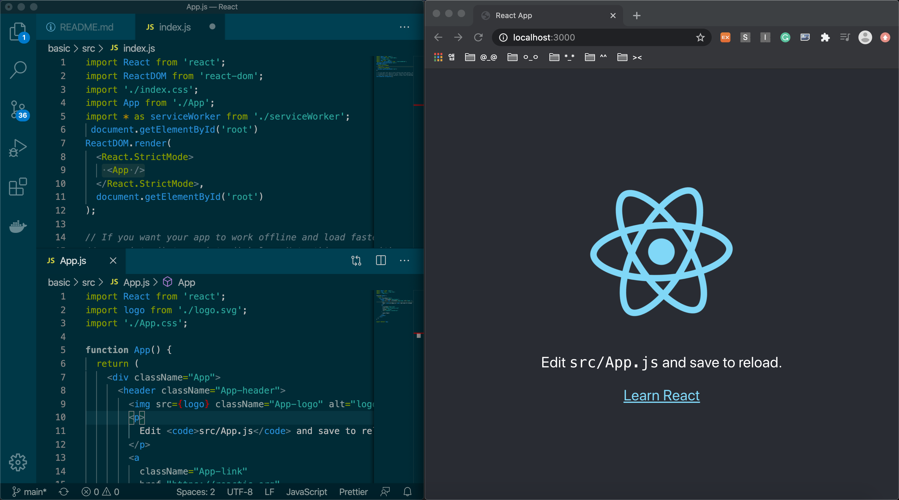
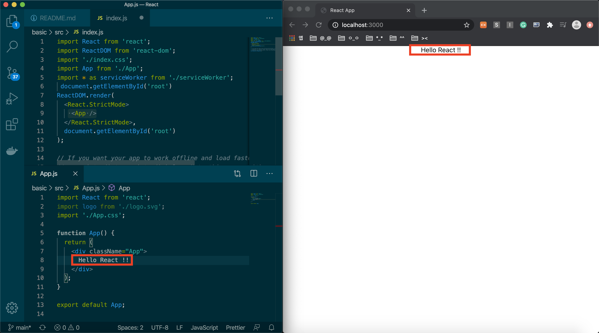
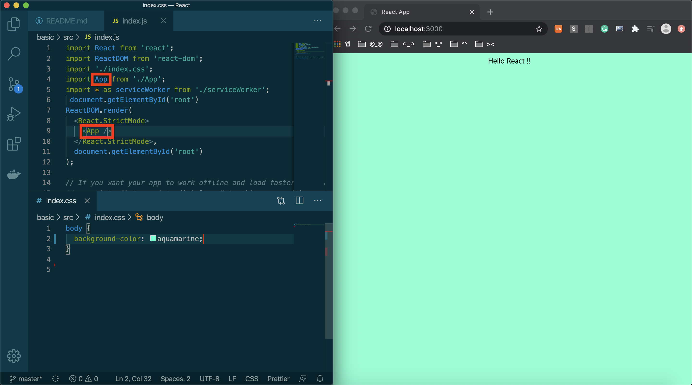
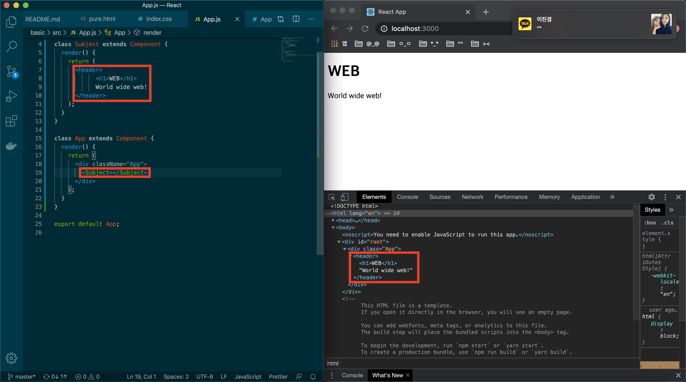

# React


### Basic
- 영상 : [생활코딩 React 강의](https://www.youtube.com/watch?v=nvRlr_qPfBc&list=PLuHgQVnccGMCRv6f8H9K5Xwsdyg4sFSdi&index=4)

<br>

- install

```
npx create-react-app basic
cd basic
npm run start
```
위와 같이 설치해주고 실행하면 새창이 띄워지면서 웹서버를 확인할 수 있다.

<br>

React는 src폴더안에서 다뤄야한다.
진입파일 : index.js
 - document.getElementById('root') : index.html안에 id가 root인 태그를 선택


<br>

아래의 두 코드는 같다.
위 수업에서는 class 방식을 사용

- function type
```javascript
import React from 'react';
import './App.css';
function App() {
    return (
        <div className="App">

        </div>
    );
}
export default App;
```

- class type
```javascript
import React, { Component } from 'react';
import './App.css';

class App extends Component {
    render() {
        return (
            <div className="App">
            
            </div>
        );
    }
}

export default App;
```

<br>

- example
<div align="center"></img></div>

index.js에서 App.js를 import해서 사용

<br>

<div align="center"></img></div>

App.js의 App function을 수정하여 동작하는것 자체를 변경해서 사용한다.


<br>

<div align="center"></img></div>

index.css로 디자인 할 수 있으며
index.js로 불러온 `import 여기 from './App';` 이 부분과 하위 부분  `<여기 />`내의 명칭이 같아야한다.

<br>

- 빌드할때 : npm run build
실제 서비스할 때는 build안에 파일 사용
실서버 환경 완성

- npx serve -s build : serve라는 웹서버 다운로드 받아서 실행시킬때 build를 document root로 하겠다.

<br>

- Component 만들기
```javascript
class App extends Component { //
  render() {
    return (
      <div className="App">
        Hello React !! 
      </div>
    );
  }
}
```
: App이라는 class를 만들고 react가 갖고있는 component라는 클래스를 상속해서 새로운 클래스를 만드는 것, 그 클래스는 render라는 메소드를 가지고 있다.

<br>

- html -> react로 바꾸기 
```html
<html>
    <body>
        <header>
            <h1>WEB</h1>
            World wide web!
        </header>
    </body>
</html>
```
: header태그 부분을 Subject라는 이름으로 변경하고 싶음

<br>

- Component에서는 최상위 태그만 사용할 수 있음

<div align="center"></img></div>

: Subject 컴포넌트를 만들어서 App 컨포넌트에 태그를 불러와서 실행해주면 html 코드로 보여지는 것을 확인할 수 있다.

<br>

- props
```javascript
class Subject extends Component {
  render() {
    return (
      <header>
            <h1>{this.props.title}</h1>
            {this.props.sub}
      </header>
    );
  }
}
```

```javascript
 <Subject title="WEB" sub="world wide web!"></Subject>
<Subject title="React" sub="for UI"></Subject>
```

: props를 사용하여 같은 컨포넌트를 다른 내용으로 재사용할 수 있음 -> 사용자 정의 태그

<br>

- [React Developer Tools](https://chrome.google.com/webstore/detail/react-developer-tools/fmkadmapgofadopljbjfkapdkoienihi/related)
위 Tool을 설치하면 개발자 도구로 리액트 코드를 확인할 수 있고, 다른값을 넣어 테스트 해볼 수 있다.

<br>

- state

props : 사용자가 컨포넌트를 사용하는 입장에서 중요
state : prop에 따라서 내부 구현에 필요한 것

constructor : 어떤 컨포넌트가 실행될때 render()보다 먼저 실행되면서 컨포넌트를 초기화해주고 싶은 것은 constructor에 선언.(제일먼저 실행되서 초기화를 담당)

<br>

react에서는 props,state의 값이 바뀌면 state를 가지고 있는 컴포넌트의 render()가 호출된다. render()의 하위 컴포넌트들도 호출된다. -> props나 state가 변경되면 화면이 다시 그려짐

> render : 어떤 html을 그릴것인가 

