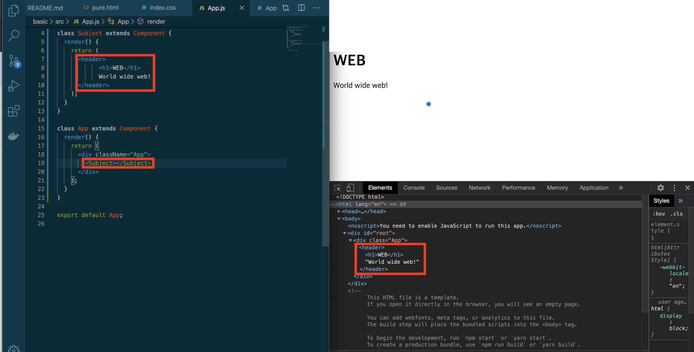
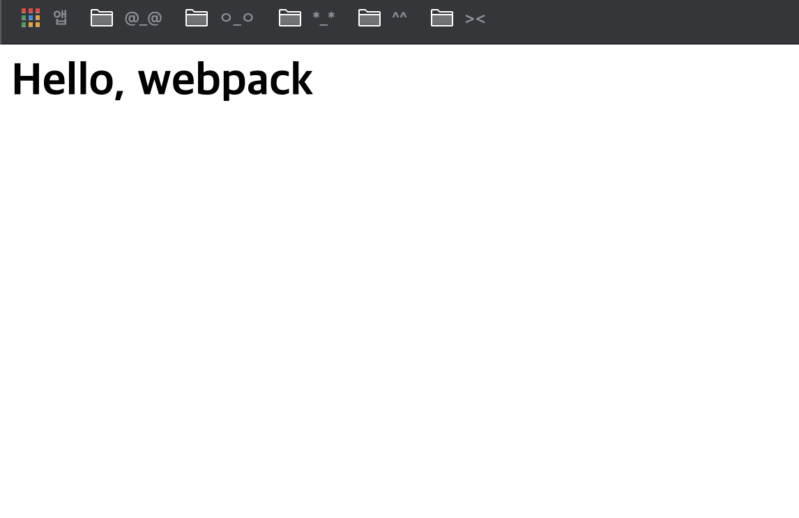

# React


### Basic
- 영상 : [생활코딩 React 강의](https://www.youtube.com/watch?v=nvRlr_qPfBc&list=PLuHgQVnccGMCRv6f8H9K5Xwsdyg4sFSdi&index=4)

<br>

- install

```
npx create-react-app basic
cd basic
npm run start
```
위와 같이 설치해주고 실행하면 새창이 띄워지면서 웹서버를 확인할 수 있다.

<br>

React는 src폴더안에서 다뤄야한다.
진입파일 : index.js
 - document.getElementById('root') : index.html안에 id가 root인 태그를 선택


<br>

아래의 두 코드는 같다.
위 수업에서는 class 방식을 사용

- function type
```javascript
import React from 'react';
import './App.css';
function App() {
    return (
        <div className="App">

        </div>
    );
}
export default App;
```

- class type
```javascript
import React, { Component } from 'react';
import './App.css';

class App extends Component {
    render() {
        return (
            <div className="App">
            
            </div>
        );
    }
}

export default App;
```

<br>

- example
<div align="center"></img></div>

index.js에서 App.js를 import해서 사용

<br>

<div align="center"></img></div>

App.js의 App function을 수정하여 동작하는것 자체를 변경해서 사용한다.


<br>

<div align="center"></img></div>

index.css로 디자인 할 수 있으며
index.js로 불러온 `import 여기 from './App';` 이 부분과 하위 부분  `<여기 />`내의 명칭이 같아야한다.

<br>

- 빌드할때 : npm run build
실제 서비스할 때는 build안에 파일 사용
실서버 환경 완성

- npx serve -s build : serve라는 웹서버 다운로드 받아서 실행시킬때 build를 document root로 하겠다.

<br>

- Component 만들기
```javascript
class App extends Component { //
  render() {
    return (
      <div className="App">
        Hello React !! 
      </div>
    );
  }
}
```
: App이라는 class를 만들고 react가 갖고있는 component라는 클래스를 상속해서 새로운 클래스를 만드는 것, 그 클래스는 render라는 메소드를 가지고 있다.

<br>

- html -> react로 바꾸기 
```html
<html>
    <body>
        <header>
            <h1>WEB</h1>
            World wide web!
        </header>
    </body>
</html>
```
: header태그 부분을 Subject라는 이름으로 변경하고 싶음

<br>

- Component에서는 최상위 태그만 사용할 수 있음

<div align="center"></img></div>

: Subject 컴포넌트를 만들어서 App 컨포넌트에 태그를 불러와서 실행해주면 html 코드로 보여지는 것을 확인할 수 있다.

<br>

- props
```javascript
class Subject extends Component {
  render() {
    return (
      <header>
            <h1>{this.props.title}</h1>
            {this.props.sub}
      </header>
    );
  }
}
```

```javascript
 <Subject title="WEB" sub="world wide web!"></Subject>
<Subject title="React" sub="for UI"></Subject>
```

: props를 사용하여 같은 컨포넌트를 다른 내용으로 재사용할 수 있음 -> 사용자 정의 태그

<br>

- [React Developer Tools](https://chrome.google.com/webstore/detail/react-developer-tools/fmkadmapgofadopljbjfkapdkoienihi/related)
위 Tool을 설치하면 개발자 도구로 리액트 코드를 확인할 수 있고, 다른값을 넣어 테스트 해볼 수 있다.

<br>

- state

props : 사용자가 컨포넌트를 사용하는 입장에서 중요
state : prop에 따라서 내부 구현에 필요한 것

constructor : 어떤 컨포넌트가 실행될때 render()보다 먼저 실행되면서 컨포넌트를 초기화해주고 싶은 것은 constructor에 선언.(제일먼저 실행되서 초기화를 담당)

<br>

react에서는 props,state의 값이 바뀌면 state를 가지고 있는 컴포넌트의 render()가 호출된다. render()의 하위 컴포넌트들도 호출된다. -> props나 state가 변경되면 화면이 다시 그려짐

> render : 어떤 html을 그릴것인가 

<br>

개발자 모드에서 `debugger`라는 부분에서 실행을 멈춤 - 기다리고 있는 상태

e.preventDefault() : 기본적인 동작을 막음 - html 태그들에 대해 이벤트를 걸때는 태그가 갖고있는 기본적인 동작을 못하게 해야하는 경우가 있음 그럴때 사용 

<br>

- bind() - this를 가르키는 context를 변경하여 바로 실행시켜주는 메소드

예시 
```javascript
var obj = {name:'boka'};

function bindTest(){
  console.log(this.name);
}

bindTest();
>> undefined

var bindTest2 = bindTest.bind(obj);

bindTest2();
>> boka
```

-----

백엔드 : Heroku 배포
프론트엔드 : netlify 배포

<br>

## Lecture

- 영상 : [제로초님의 React 강의](https://www.youtube.com/watch?v=V3QsSrldHqI&list=PLcqDmjxt30RtqbStQqk-eYMK8N-1SYIFn)


- 웹팩 : react -> javascript 파일로 만들어주는 것 
- reactDOM : 화면에 실제로 렌더링해줌
- 순서대로 실행
- state : 바뀌는 부분, 바뀔 수 있는 부분
  - ex) Like -> Liked 
- babel : 모든 브라우저에서 돌아갈 수 있는 문법으로 바꿔줌
  - javascript에서 html 문법을 사용할 수 있음

<br>

- 기존에 return 뒤에 div 태그로 감싸줘야만 에러가 안나는데 그럴경우 CSS를 적용하는데에 번거로움이 생김
- 대신 `<>`태그로 감싸주거나, `<React.Fragment>` 태그로 감싸주면 불필요한 div태그를 방지할 수 있음.

``` javascript
// 변경 전
return (
  <div>
      <div>{this.state.first} 곱하기 {this.state.second}는?</div>
      <form onSubmit = {this.onSubmit}>
          {/*input에서 onChange, setState로 값을 변경해주지않으면 상태가 변경되지않음*/}
          <input type="number" value={this.state.value} onChange={this.onChange}/> 
          <button>입력!</button>
      </form>
      <div>{this.state.result}</div>
  <div>
)
```

```javascript
// 변경 후
return (
  <React.Fragment>
      <div>{this.state.first} 곱하기 {this.state.second}는?</div>
      <form onSubmit = {this.onSubmit}>
          {/*input에서 onChange, setState로 값을 변경해주지않으면 상태가 변경되지않음*/}
          <input type="number" value={this.state.value} onChange={this.onChange}/> 
          <button>입력!</button>
      </form>
      <div>{this.state.result}</div>
  </React.Fragment>
)
```

<br>

- react의 편한점 : 데이터를 변화시키면 화면에 자동으로 보여줌

### setState : 새로운 값을 리턴하는 함수

```javascript
// 변경 전 
 if(parseInt(this.state.value)=== this.state.first * this.state.second) {
  this.setState({
      result: "정답 : " + this.state.value 
      first:Math.ceil(Math.random() *9),
      second:Math.ceil(Math.random() *9),
      value:'',
  });
}
```

```javascript
// 변경 후
 if(parseInt(this.state.value)=== this.state.first * this.state.second) {
  this.setState(() => {
     return{ 
      result: "정답 : " + this.state.value, //<-- 현재 state부분  //
      first:Math.ceil(Math.random() *9),                      // 미래 state 부분
      second:Math.ceil(Math.random() *9),                     //
      value:'',                                               //
     }
  });
}
```

- setState에 새로운 state를 return하는 함수를 넣어줌


```javascript
// 변경 후 
 if(parseInt(this.state.value)=== this.state.first * this.state.second) {
  this.setState((prevState) => { //예전 상태값을
     return{ // 다음 상태값에서 활용
      result: "정답 : " + prevState.value,
      first:Math.ceil(Math.random() *9),
      second:Math.ceil(Math.random() *9), 
      value:'',
     }
  });
}
```

<br>

- dom에 접근하고 싶으면 ref라는 함수를 붙여서 접근가능

- setState를 할때에는 render 함수가 다시 실행된다 -> render를 자주하면 느려짐
  - 함수 자체는 render안에 작성하는 것 보다 밖으로 꺼내서 선언해주는게 좋다.


<br>

### React Hooks

```javascript
// state 선언하는 방법
const Test= () => {
  const [example, setExample] = React.useState('초기값 선언')

  return <div>{example}</div>
}
```
- 주의할 점 : 위 예에서는 Test 컨포넌트안에 example, setExample를 선언해주어야함.

- Hooks에서는 input의 ref를 `React.useRef(null)`를 통해 dom에 접근한다.
  - dom에 접근할때는 current라는걸 추가하여 `inputRef.current.focus()` 형식으로 접근
- Hooks에서는 상태를 바꾸면 함수 전체가 다시 실행 -> 조금 더 느릴 수 있음
- react사용시 html 태그안에서는 class -> className, for -> htmlfor로 사용해야함.

<br>

### webpack
- 여러개의 자바스크립트 파일을 하나로 합친 파일로 만들어주는 것
- 웹팩을 위한 자바스크립트 실행기를 알아야한다 = 노드를 알아야한다.
- `npm i react react-dom` : react, react-dom을 설치
- `npm i -D webpack webpack-cli` : react할 때 필요한 webpack 설치 

- script로 불러오지않고 모듈로 가져옴

```
const React = require('react');
const ReactDom = require('react-dom');
```

- 파일을 쪼개는 경우 const로 선언해주고 exports로 내보내줘야한다.

```javascript
const React = require('react'); 
const { Component } = React;

class WordRelay extends Component {
    state = {

    };

    render() {

    }
}

module.exports = WordRelay;
```

<br>

- `npm i -D @babel/core` : 기본적인 babel 브라우저에 맞게 알아서 최신문법으로 가져옴
- `npm i -D @babel/preset-env` : 환경에 맞게 바꿔주는 것 
- `npm i -D @babel/preset-react` : jsx 지원
- `npm i -D babel-loader` : babel과 webpack 연결
- `npm i -D @babel/plugin-proposal-class-properties` : state 문법 사용하기위해서 설치

+) 추가 설치
- npm i react-refresh @pmmmwh/react-refresh-webpack-plugin -D
- npm i -D webpack-dev-server : 개발용 서버 

<br>

- commit : react webpack setting done

<div align="center"></img></div>

<br>

### 주의사항

- input을 사용할 떄 value를 써주려면 onChange도 함께 써주어야한다.
- 또는 defaultValue만 써준다.


<br>

### NumberBaseball

- .jsx 파일에서 export를 해주는 방법에 따라 import 하는 것이 다름
```javascript
export const hello = 'hello'; // import { hello }
export const bye = 'bye'; // import { bye }
// 한번에 가져올수도 있음 import { hello, bye }

export default NumberBaseball; // import NumberBaseball
// module.exports와 호환이 되며 노드 모듈 시스템에서는 아래 두 코드가 동일하다.
// module.exports = { hello : 'a' };
// exports.hello = 'a'
```

- webpack에서 import 쓰면 에러난다.

<br>

- map : react에서의 반복문
```javascript
<il>
    {['배열','테스트','해보기','반복문으로'].map((v) => {
        return(
            <li>{v}</li>
        )
    })}
</il>

>> 배열
>> 테스트
>> 해보기
>> 반복분으로
```

<br>

- key : 중복되면 안되는 값(고유)
  - key값에 i(index)를 넣지않는것이 좋다 = key의 목적은 성능최적화기 떄문
  - react에서 key를 기준으로 element를 추가, 수정, 삭제하기 떄문에 배열의 순서가 바뀌면 문제가 생긴다.
```javascript
<ul>
  {[
    { word : '배열' , len : 2 },
    { word : '테스트' , len : 3 },
    { word : '해보기' , len : 3 },
    { word : '반복문으로' , len : 5 },
  ].map((v) => { // (v,i)로 넣게되면 i는 index값을 출력해줌
    return ( // 화살표 함수 사용하면 생략가능
      <il key={v.word}>{v.word} - {v.len}</il>
      // 요소가 추가만 되는 배열의 경우 i를 써도 무관함.
    )
  })}
</ul>

>> 배열 - 2
>> 테스트 - 3
>> 해보기 - 3 
>> 반복문으로 - 5
```

<br>

- 컨포넌트를 따로 빼는 이유
  - 가독성
  - 재사용성
  - 성능최적화때 더 좋음
- react에서 대부분의 문제는 props로 인해 발생한다.
  - ex) 부모-자식 관계에서 자식이 자식을 갖고 `할아버지-아빠-나` 의 관계일 때, 할아버지가 나에게 props를 전달해주게 되고 점점 더 복잡한 관계가 되는 경우 => 이럴 경우에 쓰이는게 redux, context
- react 자체에 context가 있고 context를 좀 더 복잡한일을 할 수 있게 만든것이 redux
- 주석 : `{/* */}`

<br>

- 불변성 : react에서는 아래와 같은 코드처럼 작성하면 안된다.
  - react가 어떤게 변했는지 감지를 하지 못하기 떄문
```javascript
const array = []
array.push(1)
array
>> [1]
```

- 감지하게 하는 방법
  - 새로운 변수에 기존 배열을 복사해두고, 새로운 값을 넣어준다.
  - push를 하면 바뀐게 없다고 인식하고 렌더를 하지않는다.
```javascript
const array2 = [...array, 2]
array2
>> [1, 2]
```

<br>

### 리액트 성능향상
- Props나 state가 바뀌었을 떄 render가 다시된다.
  - setState에 값이 없어도 작동을 하기때문에 렌더링이 되지않아야할때도 렌더링이 되어버린다.
  - shouldComponentUpdate 함수로 렌더링을 할 경우와 아닌경우에 대해 조건을 주어서 처리하면 재랜더링이 되지않는다.
- shouldComponentUpdate 대신 PureComponent를 사용하는 방법도 있음
    - PureComponent는 객체({})나 배열([]) 바뀌었는지 안바뀌었는지 판단하는걸 어려워함.
    - setState에서 {a:1}을 하면 새로 렌더링이 되므로 state에 객체구조를 안쓰는것이 좋다.

<br>

### React.createRef 
- 기존에 input태그에 ref를 쓰면 함수를 만들어서 사용하곤 했는데, createRef를 호출해서 사용하면 inputRef에 createRef()를 담아서 사용할 수 있다. (더 간편)
- 기존에 만들어서 사용했던 함수는 console.log를 찍어볼 수 있고 예전 state를 가져올 수 있고, 미세한 작업을 할 수있고  다른 동작을 수행할 수 있는 장점이 있다.
- 미세한 동작 필요없이 사용한다면 간편하게 createRef를 사용하는 것이 좋을 수 있다.

<br>

- render안에는 setState를 쓰지않도록 유의
  - render가 실행되면 this.setState가 실행되고 this.setState가 실행되면 render가 실행되기 때문 

<br>

- 1) props는 부모가 바꿔줘야한다.
- 2) 자식에서 props를 바꿔주어야할 경우, props를 state에 넣어준다.

```javascript
const Try = memo(({tryInfo}) => {
  // tryInfo.try = 'hello'; <- 1의 예) 이렇게 사용하지않도록 주의
  // const [result, setResult] = useState();
    return(
       <li>
           <div>{tryInfo.try}</div>
           <div>{tryInfo.result}</div>
       </li>
    )
})
```
<br>

- 부모로 받은 props를 바꾸고 싶을 때에는 아래처럼 state를 useState로 만든다음에 state로 바꿔줘야한다.
  - **props는 직접 바꾸지 않고 state를 사용해서 바꾼다 !**
  - props가 부모에서 자식으로 물려준 것이니, 자식이 props를 바꾸면 부모의 props도 바뀌어야하는데 그럴경우 뜻하지않게 바뀌어버린다. 
    => 자식은 props를 바꾸지 않는다. 
    => 바꿔야하는 상황이라면 props를 state로 만들어서 바꾼다.

```javascript
const Try = memo(({tryInfo}) => {
  const [result, setResult] = useState(tryInfo.result);

  const onClick() => {
    setResult('1');
  }
    return(
       <li>
           <div>{tryInfo.try}</div>
           <div>{tryInfo.result}</div>
       </li>
    )
})
```