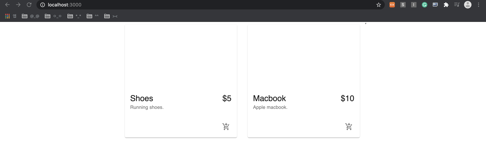

## e-commerce web shop clone coding
- [adrianhajdin님의 project_e_commerce 참고](https://github.com/adrianhajdin/project_e_commerce)

 

### setting
- `npx create-react-app ./` : 초기화
- `npm install @material-ui/core @material-ui/icons @chec/commerce.js`
- `npm install @stripe/react-stripe-js @stripe/stripe-js react-router-dom react-hook-form`
- src폴더에 파일들을 지워준다.

 

### product

</img>

