## e-commerce web shop clone coding
- [adrianhajdin님의 project_e_commerce 참고](https://github.com/adrianhajdin/project_e_commerce)

<br>

### setting
- `npx create-react-app ./` : 초기화
- `npm install @material-ui/core @material-ui/icons @chec/commerce.js`
- `npm install @stripe/react-stripe-js @stripe/stripe-js react-router-dom react-hook-form`
- src폴더에 파일들을 지워준다.
- [material-ui](https://material-ui.com/components/)

<br>

### product
<div align="center"></img></div>

<br>

### import
- App.js에서 component를 import 할때, 1번 방법보다 2번 방법을 사용하는게 간단하다.
- 하지만 2번방법을 사용하기 위해서는 component폴더에 index.js 파일을 생성해주어야한다.

```
1)
import Products from './components/Products/Products';
import NavBar from './components/NavBar/NavBar';
```

```
2)
import { Products, NavBar } from './components/';
```

<br>

### Navbar
- Navbar와 Shopping cart 생성

<div align="center">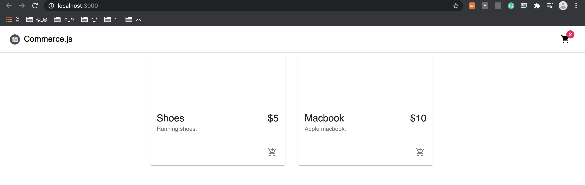</img></div>


- 하지만 현재는 Navbar가 product를 가리고 있는 문제가 있음
    - product의 style 추가
    - main 태그의 className을 classes.content로 지정
    - div 태그의 className을 classes.toolbar로 지정
<div align="center">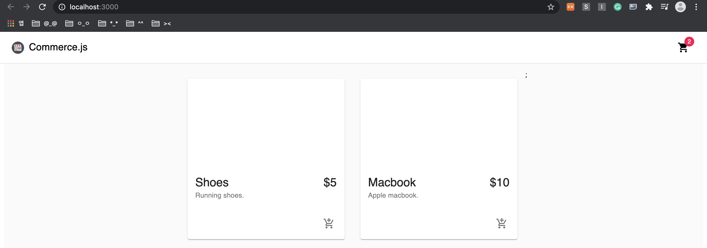</img></div>

<br>

### lib/commerce.js
: 실제 제품을 가져올 수 있는 레이아웃 생성
- 새로운 인스턴스를 생성해준다.
- 매개변수를 저장하려면 Public Key를 저장해야한다.
```
import Commerce from '@chec/commerce.js';

export const commerce = new Commerce();
```

- https://commercejs.com/docs/에 계정을 등록하고, 로그인한 뒤 API키를 받는다.
- Developer >> setttings 
- .env파일을 만들어 key를 액세스 해준다.


<br>

### App.js
#### 첫번째. 제품을 가져오는일
- 제품을 추가하고 싶은 경우 
    - [위 웹사이트](https://commercejs.com/docs/)에서 추가가 가능하다.
    - 현재 코드로 작성하는 부분은 다 프론트엔드쪽이고, 백엔드는 API를 사용하여 처리.

<br>

<div align="center">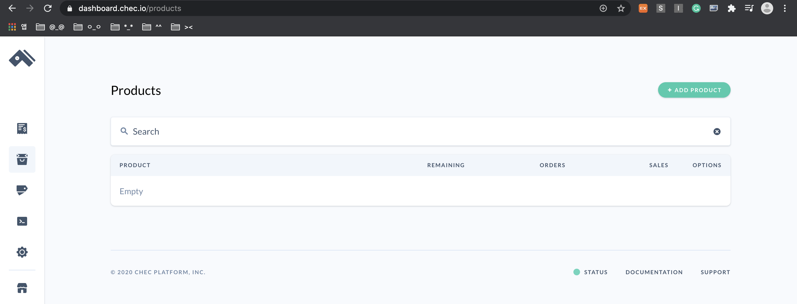</img></div>

<br>

<div align="center">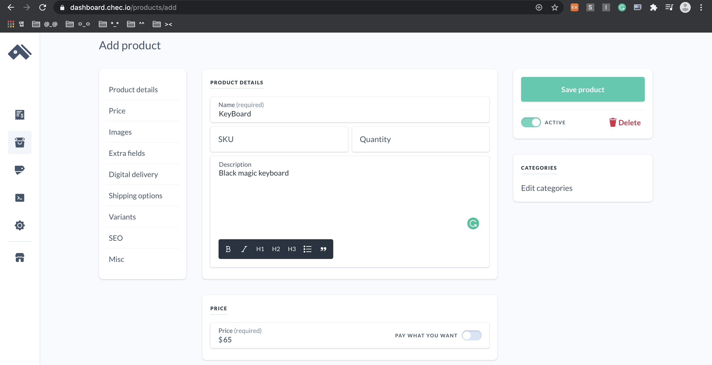</img></div>

<br>

<div align="center">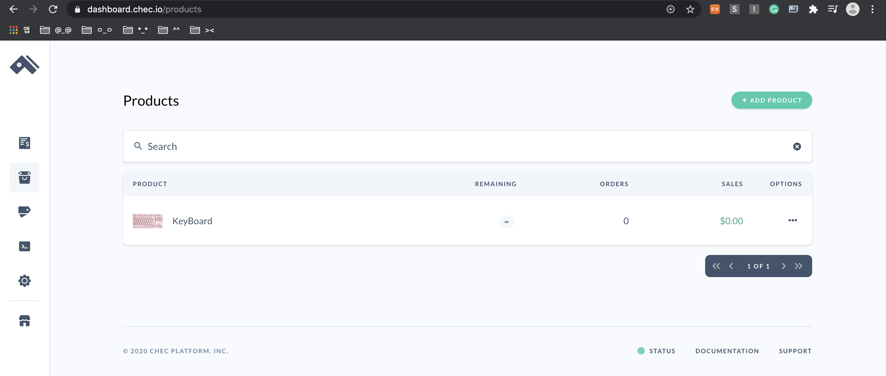</img></div>


<br>

- setting >> Shipping 에서 Shipping Zones을 추가할 수 있다.
- 맨처음 console에 log를 찍은것은 아무것도 반환하지 않지만, 페이지로 업로드한 keyboard의 내용은 출력된다.

<div align="center">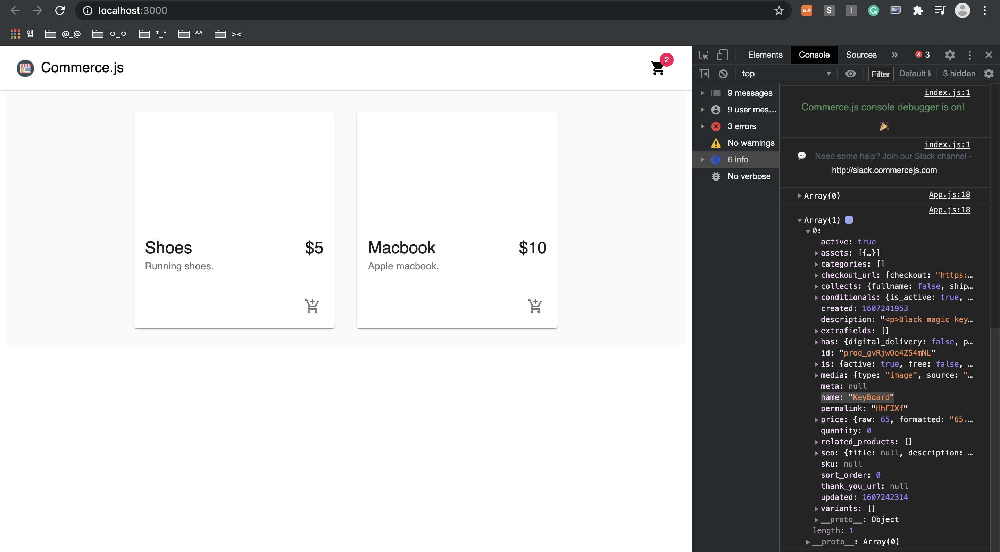</img></div>

<br>

- description을 HTML 형식에서 변경시켜놓고 처리
- 실제 e-commerce처럼 보여짐.

<div align="center">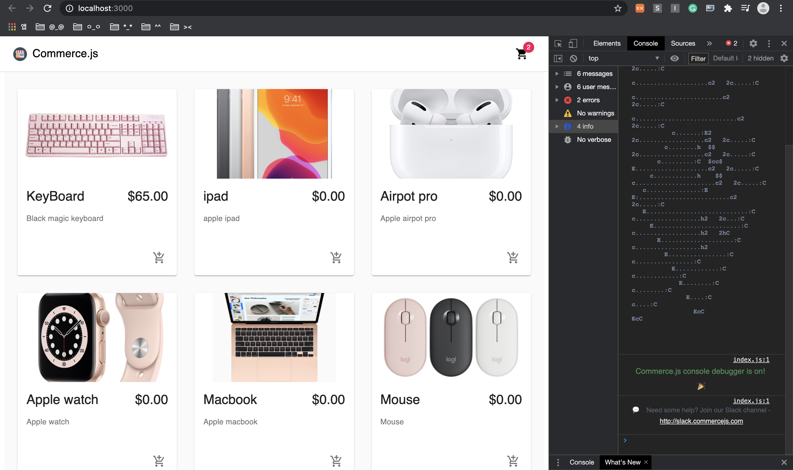</img></div>

<br>

#### 두번째. Shopping Cart에 product 담기
- onAddToCart : 카트에 물건을 추가하는 기능
- product id와 물건의 수량(quantity)을 받아서 넘겨줌
- product component에 IconButton 태그에 콜백함수로 onAddToCart를 호출하고 두 개의 인자를 넘겨준다.
    - product.id, 1로 우선 테스트 진행
- 맨위에 고정된 카트 아이콘의 숫자는 Navbar에서 변경해야함.
    - totalItems을 추가하여 cart를 클릭할떄마다 +1씩 증가하도록 변경

<br>

### Cart component
- 맨처음에 container tag를 사용하는 이유는 패딩간격이 주어져있어서 div대신 사용
- 장바구니가 비어있는지 아닌지 논리를 파악하는 과정 (isEmpty)
    - cart의 line_items의 길이로 논리화
- EmptyCart : 카트에 항목이 없을 경우, typography로 항목이 없다는것을 나타냄
- FilledCart : 카트에 항목이 있을 경우, 장바구니를 렌더링 해주어야함(Grid형식)
- app.js를 통해서 cart로 항목을 전달해줘야한다.
- 라우터를 통해 product와 cart 사이를 이동할 예정.(app.js에 product 잠시 주석처리)
- line_items가 비어있을때의 조건을 주어야함
    - 그렇지않으면 TypeError: Cannot read property 'length' of undefined 발생

<div align="center">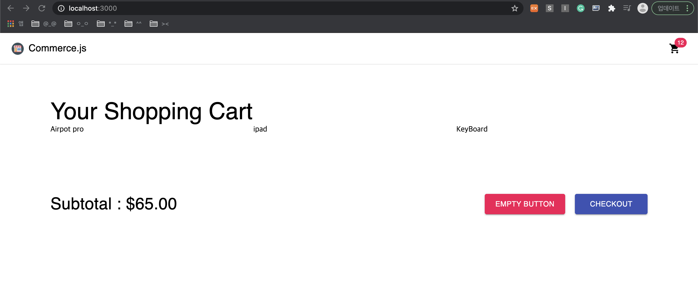</img></div>

<br>

### CartItem component
- 장바구니 세부항목

<br>

#### 반응 라우터 구현
- 대부분 app.js의 구성요소에 있음
- app.js에 BrowserRouter, Switch, Route 추가
- return 값을 Router로 감싸주어 navbar를 항상 표시되도록 해준다. 
- Switch를 사용하여 product와 cart 사이를 전환해준다.
    - Switch안에 Route를 사용하여 경로를 지정(home(/), cart)
    - 아래의 사진처럼 URL을 변경하면 화면이 다르게 나타난다.

<br>

- localhost:3000

<div align="center">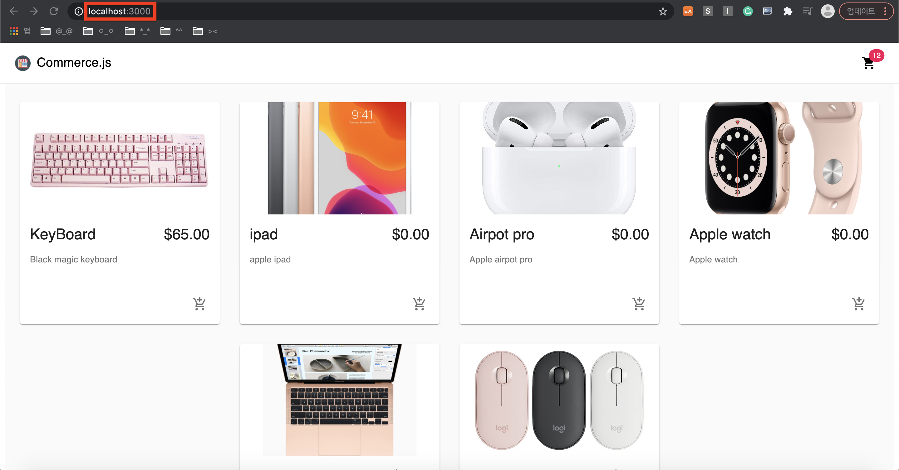</img></div>

<br>

- localhost:3000/cart

<div align="center">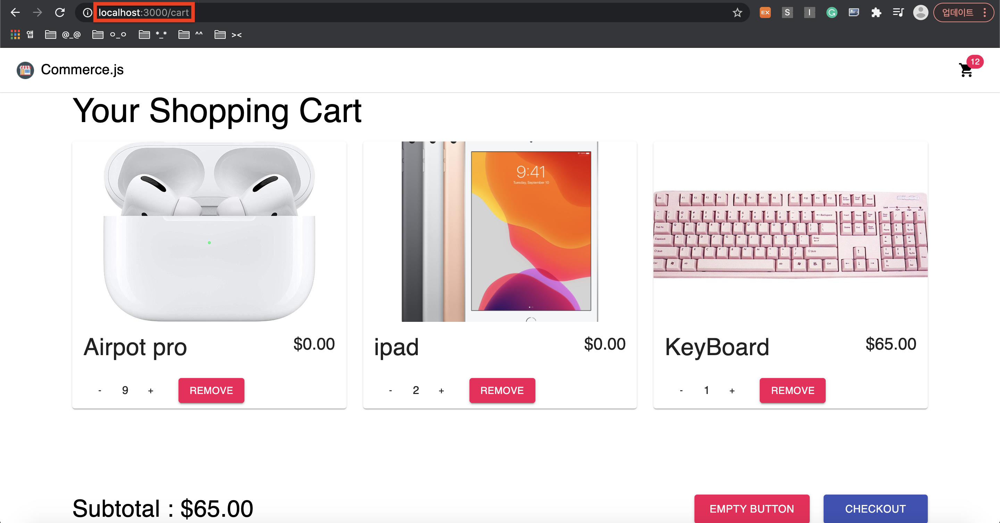</img></div>


<br>

### URL을 변경하지않고 우측상단 cart icon을 클릭하여 사용자가 페이지를 이동할 수 있도록 변경
- Navbar 구성요소를 가져옴 -> import Link 
- `<Link to='cart'>go to cart</Link>`로 변경이 가능한데 @material-ui를 이용하여 `<IconButton component={Link} to='cart'>`로 코드작성.
- home에 있을때만 cart icon을 보여줄 수 있도록 Navbar수정 (&&)

<br>

### handleUpdateCartQty, handleRemoveFromUpdate, handleEmptyCart
- 카드 수량은 비동기와 같은 수량
- API 호출에 대한 응답을 받은 다음 productId에 대해 수량을 update
    - response를 사용하지않고 { cart }로 처리가능 -> (response.cart가 아니라 cart로 사용가능해짐) 
- cart.jsx로 돌아가 empty버튼을 클릭했을때 handleEmptyCart 적용
- cartItem에 onUpdateCartQty, onRemoveFromCart 적용 
- -, + button에 onClick의 콜백함수로 업데이트시 item의 id와 새로운 수량(quantity -1, +1)을 전달

<br>

- 아래처럼 cart에서는 cart icon이 사라졌고, -버튼과 +버튼, remove 버튼이 적용된다.
<div align="center">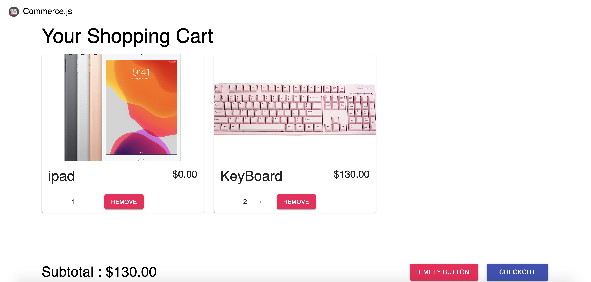</img></div>

<br>

- empty 버튼 적용시
<div align="center">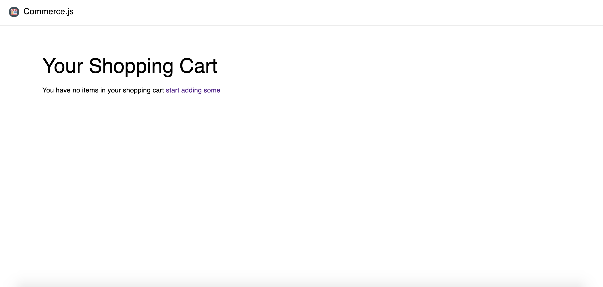</img></div>


=> 여기까지 프로젝트 앞부분, 이제 결제(check out)기능 구현 예정

<br>

### checkout
- cart에서 시작
    - Checkout 버튼에 Link를 연결해주고 /checkout path 작성
- app.js에서 Route생성 -> checkout 구성요소 
- Stepper : 단계를 이동할때 구성요소
    - steps이라는 단계의 배열을 만들어주고 반복문을 통해 매핑
        - 배송지 주소
        - 결제 세부정보 
- Paper의 elevation는 고도를 나타냄.
    - 0에 가까울수록 표시가 덜되고 0에서 멀어질수록 진해짐.
    - [codesandbox-demo](https://codesandbox.io/s/q78hq?file=/demo.js:479-498)
- cart에서 checkout button 클릭시,
<div align="center">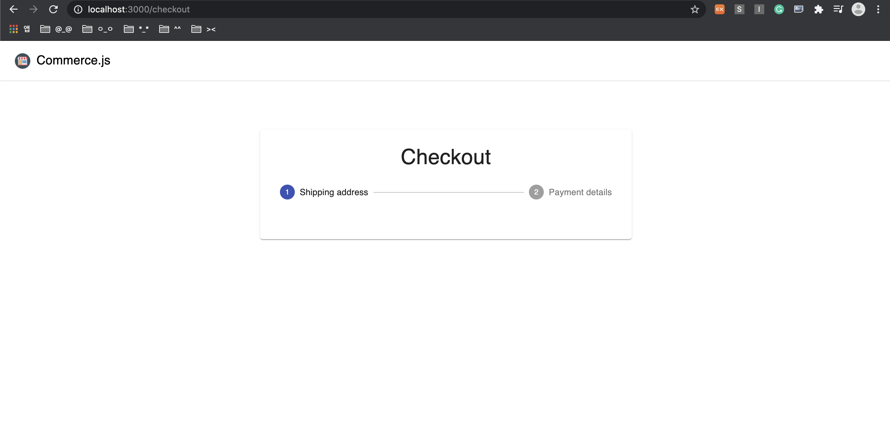</img></div>

<br>

- 두개의 다른 구성요소 렌더링
    - 배송지 주소
    - 결제 세부정보
- activeStep이 0이면 AddressForm, 그렇지않으면 PaymentForm 활성화
    - 지불양식 단계가 변경되고 Confirmation양식 표시 -> 올바르게 했을때 확인받도록
    - 확인하지 않으면 Form을 보여줌
    - steps.length로 activeStep 논리 실행
- 임시로 useState()를 변경하여 잘적용되는지 테스트

<br>

- useState(0)일때
<div align="center">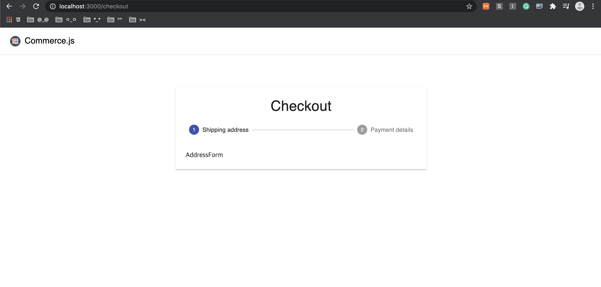</img></div>

<br>

- useState(1)일때
<div align="center">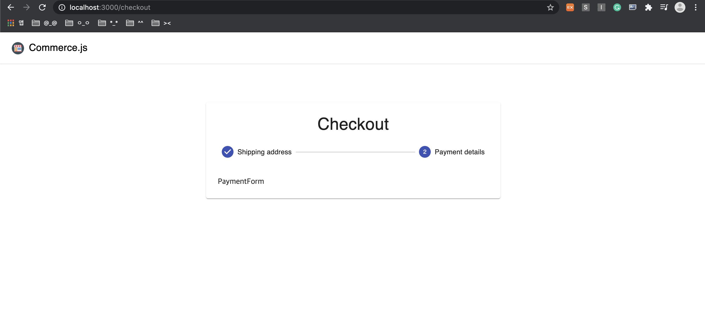</img></div>

<br>

- useState(2)일때
<div align="center"></img></div>

<br>
    
#### AddressForm : 배송지 주소
- 주소 양식엔 다양한 필드가 존재(주소, 이메일, 도시, 우편번호, 국가 등)
- [react-hook-form](https://react-hook-form.com/) 사용
- react-hook과 material-ui연결 -> 체크아웃 양식을 사용자 지정텍스트(CustomerTextField)로 하기위해 내부에 하나이상의 구성요소를 만듦
- CustomerTextField에서 name, label, required를 받아서 처리
    - 입력또는 텍스트필드들이 컨트롤러를 사용하여 제어가능(Controller)
- FormInput을 import하여 간편하게 필수적안것과 그값에 대한 name, label을 구성해준다.

<br>

- 주의 
    - CustomerTextField에서 control을 선언할때 const control이 아니라 const { control }로 하지않으면 Type 에러발생
    - TypeError: Cannot read property 'isReValidateOnBlur' of undefined

<div align="center"></img></div>
