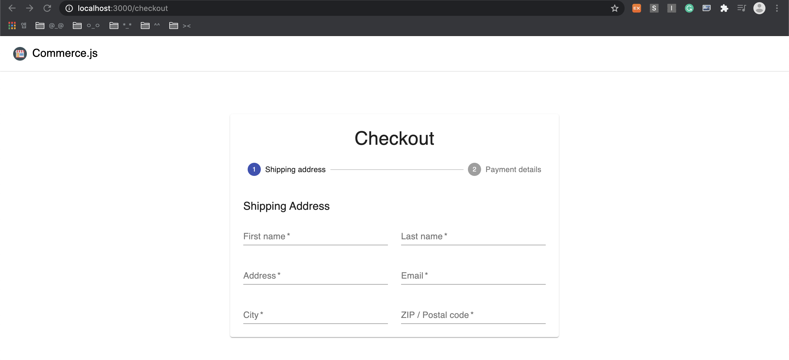
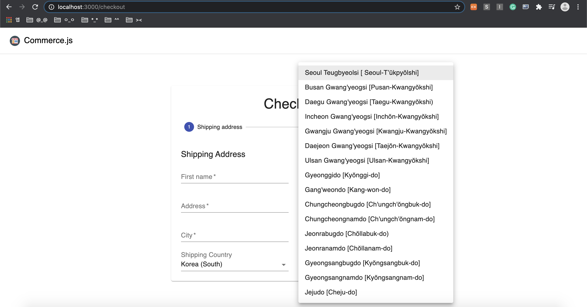

## e-commerce web shop clone coding
- [adrianhajdin님의 project_e_commerce 참고](https://github.com/adrianhajdin/project_e_commerce)

<br>

### setting
- `npx create-react-app ./` : 초기화
- `npm install @material-ui/core @material-ui/icons @chec/commerce.js`
- `npm install @stripe/react-stripe-js @stripe/stripe-js react-router-dom react-hook-form`
- src폴더에 파일들을 지워준다.
- [material-ui](https://material-ui.com/components/)

<br>

### product
<div align="center"></img></div>

<br>

### import
- App.js에서 component를 import 할때, 1번 방법보다 2번 방법을 사용하는게 간단하다.
- 하지만 2번방법을 사용하기 위해서는 component폴더에 index.js 파일을 생성해주어야한다.

```
1)
import Products from './components/Products/Products';
import NavBar from './components/NavBar/NavBar';
```

```
2)
import { Products, NavBar } from './components/';
```

<br>

### Navbar
- Navbar와 Shopping cart 생성

<div align="center"></img></div>


- 하지만 현재는 Navbar가 product를 가리고 있는 문제가 있음
    - product의 style 추가
    - main 태그의 className을 classes.content로 지정
    - div 태그의 className을 classes.toolbar로 지정
<div align="center"></img></div>

<br>

### lib/commerce.js
: 실제 제품을 가져올 수 있는 레이아웃 생성
- 새로운 인스턴스를 생성해준다.
- 매개변수를 저장하려면 Public Key를 저장해야한다.
```
import Commerce from '@chec/commerce.js';

export const commerce = new Commerce();
```

- https://commercejs.com/docs/에 계정을 등록하고, 로그인한 뒤 API키를 받는다.
- Developer >> setttings 
- .env파일을 만들어 key를 액세스 해준다.


<br>

### App.js
#### 첫번째. 제품을 가져오는일
- 제품을 추가하고 싶은 경우 
    - [위 웹사이트](https://commercejs.com/docs/)에서 추가가 가능하다.
    - 현재 코드로 작성하는 부분은 다 프론트엔드쪽이고, 백엔드는 API를 사용하여 처리.

<br>

<div align="center"></img></div>

<br>

<div align="center"></img></div>

<br>

<div align="center"></img></div>


<br>

- setting >> Shipping 에서 Shipping Zones을 추가할 수 있다.
- 맨처음 console에 log를 찍은것은 아무것도 반환하지 않지만, 페이지로 업로드한 keyboard의 내용은 출력된다.

<div align="center"></img></div>

<br>

- description을 HTML 형식에서 변경시켜놓고 처리
- 실제 e-commerce처럼 보여짐.

<div align="center"></img></div>

<br>

#### 두번째. Shopping Cart에 product 담기
- onAddToCart : 카트에 물건을 추가하는 기능
- product id와 물건의 수량(quantity)을 받아서 넘겨줌
- product component에 IconButton 태그에 콜백함수로 onAddToCart를 호출하고 두 개의 인자를 넘겨준다.
    - product.id, 1로 우선 테스트 진행
- 맨위에 고정된 카트 아이콘의 숫자는 Navbar에서 변경해야함.
    - totalItems을 추가하여 cart를 클릭할떄마다 +1씩 증가하도록 변경

<br>

### Cart component
- 맨처음에 container tag를 사용하는 이유는 패딩간격이 주어져있어서 div대신 사용
- 장바구니가 비어있는지 아닌지 논리를 파악하는 과정 (isEmpty)
    - cart의 line_items의 길이로 논리화
- EmptyCart : 카트에 항목이 없을 경우, typography로 항목이 없다는것을 나타냄
- FilledCart : 카트에 항목이 있을 경우, 장바구니를 렌더링 해주어야함(Grid형식)
- app.js를 통해서 cart로 항목을 전달해줘야한다.
- 라우터를 통해 product와 cart 사이를 이동할 예정.(app.js에 product 잠시 주석처리)
- line_items가 비어있을때의 조건을 주어야함
    - 그렇지않으면 TypeError: Cannot read property 'length' of undefined 발생

<div align="center"></img></div>

<br>

### CartItem component
- 장바구니 세부항목

<br>

#### 반응 라우터 구현
- 대부분 app.js의 구성요소에 있음
- app.js에 BrowserRouter, Switch, Route 추가
- return 값을 Router로 감싸주어 navbar를 항상 표시되도록 해준다. 
- Switch를 사용하여 product와 cart 사이를 전환해준다.
    - Switch안에 Route를 사용하여 경로를 지정(home(/), cart)
    - 아래의 사진처럼 URL을 변경하면 화면이 다르게 나타난다.

<br>

- localhost:3000

<div align="center"></img></div>

<br>

- localhost:3000/cart

<div align="center"></img></div>


<br>

### URL을 변경하지않고 우측상단 cart icon을 클릭하여 사용자가 페이지를 이동할 수 있도록 변경
- Navbar 구성요소를 가져옴 -> import Link 
- `<Link to='cart'>go to cart</Link>`로 변경이 가능한데 @material-ui를 이용하여 `<IconButton component={Link} to='cart'>`로 코드작성.
- home에 있을때만 cart icon을 보여줄 수 있도록 Navbar수정 (&&)

<br>

### handleUpdateCartQty, handleRemoveFromUpdate, handleEmptyCart
- 카드 수량은 비동기와 같은 수량
- API 호출에 대한 응답을 받은 다음 productId에 대해 수량을 update
    - response를 사용하지않고 { cart }로 처리가능 -> (response.cart가 아니라 cart로 사용가능해짐) 
- cart.jsx로 돌아가 empty버튼을 클릭했을때 handleEmptyCart 적용
- cartItem에 onUpdateCartQty, onRemoveFromCart 적용 
- -, + button에 onClick의 콜백함수로 업데이트시 item의 id와 새로운 수량(quantity -1, +1)을 전달

<br>

- 아래처럼 cart에서는 cart icon이 사라졌고, -버튼과 +버튼, remove 버튼이 적용된다.
<div align="center"></img></div>

<br>

- empty 버튼 적용시
<div align="center"></img></div>


=> 여기까지 프로젝트 앞부분, 이제 결제(check out)기능 구현 예정

<br>

### checkout
- cart에서 시작
    - Checkout 버튼에 Link를 연결해주고 /checkout path 작성
- app.js에서 Route생성 -> checkout 구성요소 
- Stepper : 단계를 이동할때 구성요소
    - steps이라는 단계의 배열을 만들어주고 반복문을 통해 매핑
        - 배송지 주소
        - 결제 세부정보 
- Paper의 elevation는 고도를 나타냄.
    - 0에 가까울수록 표시가 덜되고 0에서 멀어질수록 진해짐.
    - [codesandbox-demo](https://codesandbox.io/s/q78hq?file=/demo.js:479-498)
- cart에서 checkout button 클릭시,
<div align="center"></img></div>

<br>

- 두개의 다른 구성요소 렌더링
    - 배송지 주소
    - 결제 세부정보
- activeStep이 0이면 AddressForm, 그렇지않으면 PaymentForm 활성화
    - 지불양식 단계가 변경되고 Confirmation양식 표시 -> 올바르게 했을때 확인받도록
    - 확인하지 않으면 Form을 보여줌
    - steps.length로 activeStep 논리 실행
- 임시로 useState()를 변경하여 잘적용되는지 테스트

<br>

- useState(0)일때
<div align="center"></img></div>

<br>

- useState(1)일때
<div align="center"></img></div>

<br>

- useState(2)일때
<div align="center"></img></div>

<br>
    
#### AddressForm : 배송지 주소
- 주소 양식엔 다양한 필드가 존재(주소, 이메일, 도시, 우편번호, 국가 등)
- [react-hook-form](https://react-hook-form.com/) 사용
- react-hook과 material-ui연결 -> 체크아웃 양식을 사용자 지정텍스트(CustomerTextField)로 하기위해 내부에 하나이상의 구성요소를 만듦
- CustomerTextField에서 name, label, required를 받아서 처리
    - 입력또는 텍스트필드들이 컨트롤러를 사용하여 제어가능(Controller)
- FormInput을 import하여 간편하게 필수적안것과 그값에 대한 name, label을 구성해준다.

<br>

- 주의 
    - CustomerTextField에서 control을 선언할때 const control이 아니라 const { control }로 하지않으면 Type 에러발생
    - TypeError: Cannot read property 'isReValidateOnBlur' of undefined

```javascript
import { useFormContext } from 'react-hook-form';

const context = useFormContext(); 
 <Controller control={context.control} />

 -- 구조분해 사용
 const { control } = useFormContext();
<Controller control={control} />
```

<div align="center"></img></div>

<br>

- 배송지역 -> 하위부문으로 나뉘어짐
    - Shipping Country : 배송지 
    - Shipping Subdivision : 운송부서
    - Shipping Options : 배송 옵션
- 국가가 변경될때마다 세가지 필드가 모두 변경된다.
    - useState로 6개의 상태 생성
        - 배송지, 운송부서, 배송옵션을 단수와 복수개로 만들어줌
- API 항목을 사용하여 실제로 사용가능한 모든 국가를 가져와 세분화 후, 모든 배송 옵션을 가져옴
- 배송국가와 세분화 및 옵션은 commerce.js 대시보드에서 직접 설정
- lib/commerce에서 commerce 인스턴스를 import 해줌으로써 모든 기능을 사용할 수 있음

<br>

- checkout token log 출력
<div align="center"></img></div>

<br>

---

### 배송기능구현
- fetchShippingCountries : 나라를 가져오는 기능
    - 비동기 함수로 구현
    - 주문 프로세스에 들어오면 자신의 checkoutTokenId을 만들어 배송국가를 가져오도록 전달
    - API사용(response) -> 구조를 해체하여 countries만 가져옴
- checkout의 Form에 적용시켜야함(checkout.jsx)
    - useState, useEffect를 사용하여 checkoutToken을 생성
    - useEffect 인자에 빈배열을 넣어주어 처음에만 발생하도록 해줌(나중에 cart가 변경되면 변경해줄것)
- useEffect : 결제 절차를 시작하면 체크아웃 토큰을 생성
    - 비동기가 될 새로운 함수 생성 필요(generate token)
    - try ~ catch 구문 사용(토큰생성여부에 따라 결과값 다르도록)
    - 여기서도 lib/commerce에서 commerce 인스턴스를 import(checkout.jsx)
    - try에 token생성 : 토큰 생성 및 전달해야할 사항(cart.id, {type : 'cart'}) -> type부분에서 객체를 전달하는데 token을 생성할 cart 문자열을 전달
        - cartId를 얻어오기 위해서는 App.js에서 <Checkout cart={cart}>로 변경해주어야함.
    - token에 대한 새로운 상태필드 생성

<br>

- Form 내 AddressForm에 checkoutToken을 불러옴(checkout.jsx)
- checkoutToken을 호출(AddressForm.jsx)
- AddressForm이 렌더링 되자마자 즉시 국가를 가져오고 싶음
    - useEffect를 사용하여 렌더링할때 즉시 실행되도록 함.
        - fetchShippingCountries 호출(checkoutToken.id)
        - 위 상황에서는 에러 발생(TypeError: Cannot read property 'id' of null)
    - checkout.jsx에서 useEffect의 빈배열에 cart를 넣어줘야함
    - cart가 동적으로 적용되므로 cart가 변경되자마자 또 다른 token을 회수해야함
- checkoutToken && <Form /> : 체크아웃 토큰을 확인하고 양식 종료(checkout.jsx)

<br>

- 배송가능한 지역으로 설정했던 국가들 log에 기록
<div align="center"></img></div>

<br>

- setShippingCountries : 배송 국가 설정
- setShippingCountry : 개별 국가 설정
    - object에서의 key를 가져오도록(위 사진에서 CA, KR, US), 첫번쨰 배열을 가져오도록 해야함.
- Shipping Country를 보여주는 부분에서 value를 setShippingCountry로 주고 onChange에서 event를 받고 배송국가를 설정
- countries는 배열이 아니므로 map을 사용할 수 없음
    - Object.entries()는 key와 value를 제공(shippingCountries)

<br>

- Object.entries(shippingCountries)의 log
- 배열의 배열로 구성되어있고, 각 배열에는 각 특정 국가와 키와 값이 포함되어있음
- 위 항목에 map함수로 code와 name을 요소로 줌
    - 새로운 형식(객체)으로 반환
    - code와 같도록 id를 지정
<div align="center"></img></div>

<br>

- id와 label 분리
<div align="center"></img></div>

<br>

- shipping country의 목록들이 나오면서 선택이 가능해짐
<div align="center"></img></div>


-----

- fetchSubdivisions : countrycode를 매개변수로 하위 목록들을 가져옴
    - response에서 subdivisions로 구조분해
    - setShippingSubdivision에서 객체를 세분화하여 key를 얻음
- useEffect를 새롭게 구성
    - 두가지 다른 useEffect를 사용
    - 배열에 shippingCountry를 주어 배송지역이 변경될때마다 fetchSubdivisions 호출
    - if로 조건을 주어 배송국가가 존재하는 경우에만 동작할 수 있도록 함
- countries와 같이 map함수로 code와 name을 요소로 줌
- Shipping Country을 가져온 뒤, 배송국가가 변경된 후에만 Shipping Subdivision에서 세분화를 가져올 수 있음

<br>

- shipping Subdivision 목록들이 나오면서 하위목록 선택이 가능해짐
<div align="center"></img></div>

<br>

- fetchShippingOptions : 배송옵션 -> 국내/해외배송
    - checkoutTokenId와 country, region을 매개변수로 받음(region은 null로 구성)
    - getShippingOptions에 checkoutTokenId를 전달하고 개체를 지정(country, region)
    - 선언해둔 setShippingOption함수에 options의 0번째 배열의 id를 전달(options[0].id)
- useEffect 새롭게 구성 -> 배송세부항목(shippingSubdivision)이 변경되면 호출
    - 끝에 s가 없는 단일배송 세분화
- 상단에 options 선언 -> 개체항목을 수행하지 않고 shippingOptions내의 값을 반복
    - option은 기본적으로 배열

<br>

- setShippingOptions log - array에 전체 포함
<div align="center"></img></div>

<br>

- US로 설정했을때 - array에 하나만 포함
<div align="center"></img></div>

<br>

- 배송옵션 반복
    - options mapping
    - 병합하려는 각 옵션에 대해 국내 배송이름과 특정 배송에 대한 가격을 보여줌
- setShippingOptions에 대해 sO로 받아 대해 id과 label를 분리하여 보여줌

<br>

- 배송옵션과 같은것들은 사용자 선택옵션이기 때문에 required을 true로 만들어줌 (CustomerTextField.jsx)

- 지역에 따라 배송비가 자동으로 변경
<div align="center"></img></div>

<br>

- Grid 외부에 버튼을 2개 만들어준다.
    - cart로 다시 돌아가는 기능(Back to Cart) - Link를 사용하여 cart로 돌아감
    - 다음으로 넘어가는 기능(Next) - submit type으로 지정
- 실행을 하면 cart로 돌아가는 기능은 정상작동, next 버튼이 아직 작동하지않음
    - form에 onSubmit를 사용 - 모든 필드에 대한 데이터를 채우기 위하여 콜백함수로 구성
    - checkout에 next에 대한 함수를 생성    
- next function 
    - 배송데이터(shippingData)를 빈 객체({})로 정의
- nextStep : setActiveStep에 콜백함수로 이전 상태(preActiveStep)에 1을 더해줌
- backStep : setActiveStep에 콜백함수로 이전 상태(preActiveStep)에 1을 빼줌
- 선언해준 Form에 인자값으로 설정해준다.(next={next})
- AddressForm에 가서 next를 받아올 수 있도록 작성
- onSubmit에 적용 -> next에 { ...data }로 data를 스프레드 시켜줌(FormInput 데이터를 객체에 분산)
    - data를 그냥 보내는게 아니라 {...data}로 보내주는 이유는 데이터의 속성을 전파하기 위해서이다.
    - 그런 다음 shippingCountry, shippingCountry, shippingCountry도 추가해준다.
    - next 함수를 호출하여 필요한 모든 데이터를 전달
- checkout으로 돌아가 PaymentForm에 shippingData를 추가해준다.

--------

### PaymentForm : 결제 양식
- 결제 양식에서는 [stripe/react-stripe-js](https://stripe.com/docs/stripe-js/react)와 [stripe/stripe-js](https://stripe.com/docs/stripe-js)를 사용
- Review component 생성
- checkout에 있는 token 사용 -> 위에 정의한 checkoutToken을 PaymentForm 내부에 전달
- Review에도 checkoutToken 전달
    - List에 product를 ListItem으로 나열
    - 내부에 style 지정(상단과 하단에 10px, 좌우 0px)
- 제품의 수량과 가격이 등록된 화면을 구성

<div align="center"></img></div>

<br>

- stripe로 결제화면 구성(payment form)
    - divider로 구분선을 표현
    - Element에서 stripe를 stripePromise로 받음
    - stripePromise에 대해 loadStripe함수에서 key를 받음
    - ElementsConsumer 내에 콜백함수 생성(elements, stripe)
    - back과 pay 버튼을 두개 구성
    - checkoutform에 payment 내에 backStep 추가
- stripe 적용 후 신용카드 세부정보를 입력할 수 있음
<div align="center"></img></div>

<br>


